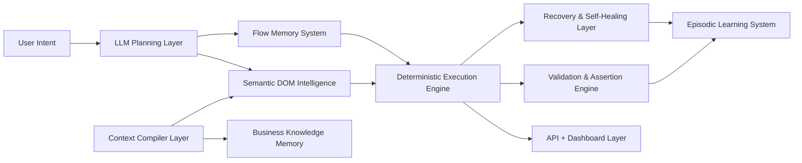

# Architecture

The platform is application operational intelligence infrastructure, not a browser-use loop. The default path is compiled context retrieval, flow graph selection, semantic target resolution, deterministic primitive execution, semantic validation, telemetry emission, and episodic learning. Selective LLM reasoning is constrained to planning, ambiguity resolution, recovery, unknown flows, and adaptation.

## Layers

1. **Context Compiler Layer** crawls applications, extracts semantic UI maps, builds embeddings, maps workflows, and refreshes selector confidence in background jobs.
2. **Business Knowledge Memory** stores domain terms, business event definitions, evidence signals, and action vocabulary.
3. **Semantic DOM Intelligence** transforms raw DOM into semantic elements with roles, business meanings, selector candidates, component relationships, and stable fingerprints.
4. **Flow Memory System** stores reusable DAG/state-machine flows that can be selected by user intent.
5. **Deterministic Execution Engine** consumes plans and invokes Playwright-backed primitives such as `open_compose_modal`, `fill_email_recipient`, `upload_attachment`, and `submit_form`.
6. **Validation & Assertion Engine** evaluates business events through weighted semantic, network, URL, storage, database, and telemetry evidence.
7. **Recovery & Self-Healing Layer** rematches changed UI elements through semantics, alternate selectors, nearby components, and historical patterns.
8. **LLM Planning Layer** uses OpenAI Responses API only when compiled memory cannot determine a deterministic path.
9. **Episodic Learning System** records failures, retries, flaky elements, timings, and recovery patterns.
10. **API + Dashboard Layer** exposes flow execution, semantic memory, history, UI graph, business graph, replay, and compiler job controls.

## Local reference wiring

The repository includes a fully wired in-memory reference path for local development. `createPlatformServices()` constructs a flow store, semantic index, context compiler, planner, primitive-enabled executor, in-memory browser adapter, and logger. By default it seeds a Gmail-style DOM snapshot and `gmail_send_attachment` flow. `createApiServer()` exposes that wiring through health, flow registration/listing, plan creation, semantic compilation/querying, and end-to-end execution endpoints.

This local wiring is intentionally adapter-oriented: package logic remains deterministic and framework-light, while apps own orchestration and runtime adapters. Production deployments should replace in-memory storage and browser adapters with persistence, queues, Playwright or equivalent browser execution, and telemetry exporters.

## Data stores

- PostgreSQL: plans, executions, assertions, audit records.
- Redis: runtime state, locks, queue hints, live execution status.
- Qdrant: semantic UI and business-context embeddings.
- Neo4j: flow graph, UI graph, business graph, and relation traversal.
- Temporal: compiler, execution, validation, and recovery workflows.
