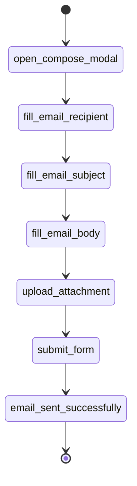

# Flow Memory

Flows are reusable DAGs that encode deterministic application behavior. They are selected by intent examples and enriched with runtime assertions.



A Gmail-style attachment flow is represented as primitives rather than live LLM decisions. The seeded local API registers this flow as `gmail_send_attachment` and exposes it through `GET /flows?applicationId=gmail`.

## Plan creation

`FlowMemoryStore` validates every registered graph as a DAG, requires the entry node to exist, rejects edges that reference missing nodes, and can list or retrieve flows. `createPlan()` matches by lexical overlap against intent examples. `createPlanFromFlow()` builds a topologically sorted `ExecutionPlan` and accepts input overrides keyed by either node id or primitive name.

Example override payload for `/plans` or `/flows/execute`:

```json
{
  "applicationId": "gmail",
  "intent": "Email a report with a file attached",
  "inputs": {
    "recipient": { "recipient": "ops@example.com" },
    "attach": { "filePath": "/tmp/ops.pdf" }
  }
}
```

## Runtime assertions

The `send` node includes an `email_sent_successfully` assertion. During local execution, the API supplies default `sent_toast` evidence so the end-to-end demo succeeds deterministically. Callers can pass an `evidence` object to override or test failure behavior.
