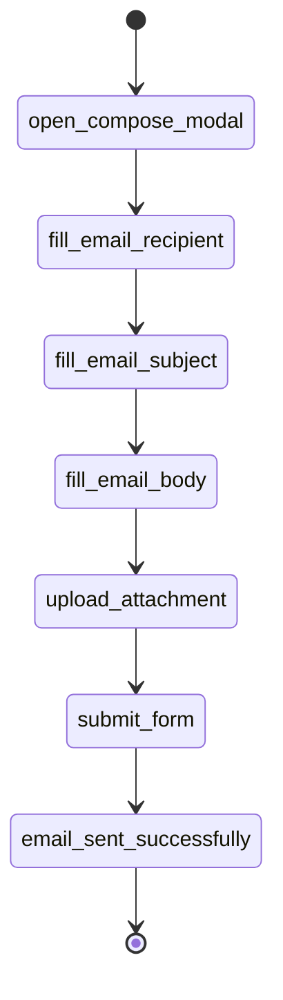

# Flow Memory

Flows are reusable DAGs that encode deterministic application behavior. They are selected by intent examples and enriched with runtime assertions.

A Gmail-style attachment flow is represented as primitives rather than live LLM decisions. The LLM may choose this flow or request missing context, but it does not decide every click at runtime.
